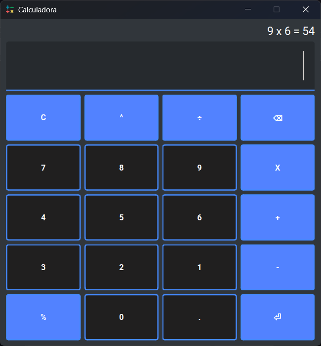

# Calculadora Python
Calculadora simples em Python com interface gráfica.

## Funcionalidade
- `Calculadora Padrão:` Calculadora padrão com funcionalidades de soma, subtração, divisão, multiplicação, potência e porcentagem.

<br>
<div display: inline_block align="center">
    
<br>
    
</div>

## Acesso ao projeto
Você pode [acessar o código-fonte do projeto](https://github.com/eii-yahs/Calculadora-py.git) ou [baixá-lo](https://github.com/eii-yahs/Calculadora-py/archive/refs/heads/main.zip).

## Abrir e rodar o projeto
Após baixar o projeto, você pode abrir com o Visual Studio Code. Para o projeto funcionar você deve ter configurado no seu PC:

* Python >= 3.13.1
* PySide6
* qt-material 2.14

Agora, na pasta do projeto abra um terminal e execute:
```bash
pip install PySide6
pip install qt-material
python main.py
```

Agora o projeto está pronto para ser utilizado.

## Tecnologias utilizadas
* `Python - 3.13.1`
* `PySide6`
* `qt-material`